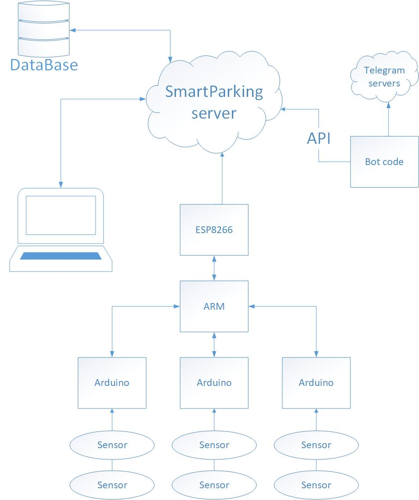

# Smart Parking 🚗 
A simple prototype of a smart parking for instrumentaion course final project

## Test
**To watch video click [here](https://youtu.be/2oAV86ZQGnY)**
## Hardware
* ESP8266 (Wemos D1 mini)
* Arduino nano
* STM32F103C8 ARM processor
* Ultrasonic sensors (SRF05)

## Topology

